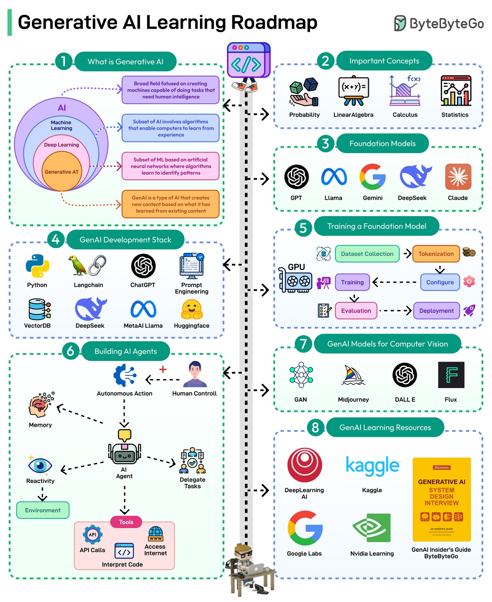

# Generative AI Roadmap

This repository provides a comprehensive roadmap for learning and mastering Generative AI technologies. It covers various topics, tools, and resources to help individuals understand and implement generative models effectively.

## Roadmaps

## Certifications

* [AWS Certified Generative AI Developer - Professional](https://aws.amazon.com/certification/certified-generative-ai-developer-professional/)
* [Google Certified: Generative AI Leader](https://cloud.google.com/learn/certification/generative-ai-leader)
* [Microsoft Certified: Azure AI Engineer Associate](https://learn.microsoft.com/en-us/certifications/azure-ai-engineer/)

### References

* [10 generative AI certifications to grow your skills by cio.com](https://www.cio.com/article/2128415/generative-ai-certifications-and-certificate-programs.html)
